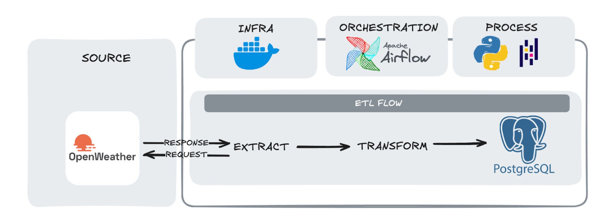

# 🌦 Weather Data Pipeline - São Paulo

End-to-end ETL pipeline that extracts real-time weather data for São
Paulo using the OpenWeather API, transforms it using Pandas, and loads
it into PostgreSQL. The pipeline is orchestrated using Apache Airflow
and fully containerized with Docker.

------------------------------------------------------------------------

## 📌 Project Overview

This project simulates a production-ready data engineering workflow:

-   Extract weather data from external API
-   Transform nested JSON into structured tabular format
-   Load processed data into PostgreSQL
-   Orchestrate tasks using Airflow DAG
-   Containerized environment with Docker

## 🏗 Architecture

  

------------------------------------------------------------------------

## 🛠 Tech Stack

-   Python 3.12
-   Pandas
-   Apache Airflow
-   Docker & Docker Compose
-   PostgreSQL
-   python-dotenv
-   uv (Python package manager)

## 🔗 Data Source

This project consumes real-time weather data from the OpenWeather API:

- API Documentation: https://openweathermap.org/current
- Endpoint used: https://api.openweathermap.org/data/2.5/weather

## 📂 Project Structure

    weather_data_pipeline/
    │
    ├── dags/
    ├── src/
    ├── data/
    ├── config/
    ├── docs/
    │   └── architecture.png
    ├── docker-compose.yaml
    └── README.md

------------------------------------------------------------------------

## ⚙️ How It Works

### 1️⃣ Extract

Fetches weather data from OpenWeather API.

### 2️⃣ Transform

-   Flattens nested JSON
-   Normalizes weather fields
-   Cleans column names
-   Stores intermediate result as Parquet

### 3️⃣ Load

-   Reads processed data
-   Inserts into PostgreSQL table `sp_weather`

------------------------------------------------------------------------

## 🚀 Running the Project

### 1. Set environment variable

Create a `.env` file inside `config/`:

    api_key=YOUR_OPENWEATHER_API_KEY

### 2. Start containers

    docker compose up -d

### 3. Access Airflow UI

    http://localhost:8080

Enable DAG:

    weather_pipeline

## 📊 Example Output Columns

| Column              | Description                 |
|---------------------|-----------------------------|
| temp                | Current temperature         |
| humidity            | Air humidity                |
| wind_speed          | Wind speed                  |
| weather_main        | Weather category            |
| weather_description | Detailed condition          |
| datetime            | Data extraction timestamp   |

## 🎯 Learning Goals

This project demonstrates:

-   API integration
-   JSON normalization
-   Data transformation with Pandas
-   Airflow DAG development
-   Docker containerization
-   ETL best practices

------------------------------------------------------------------------

## 🔮 Future Improvements

-   Store historical weather data
-   Deploy to cloud environment (GCP)
-   Add monitoring and alerts

------------------------------------------------------------------------

## 👩‍💻 Author

Adria Freitas
